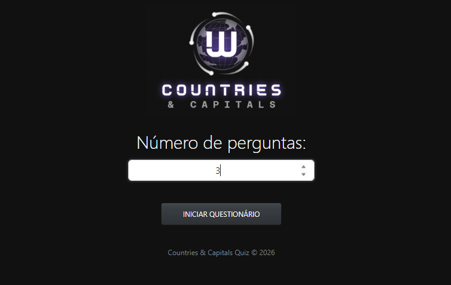
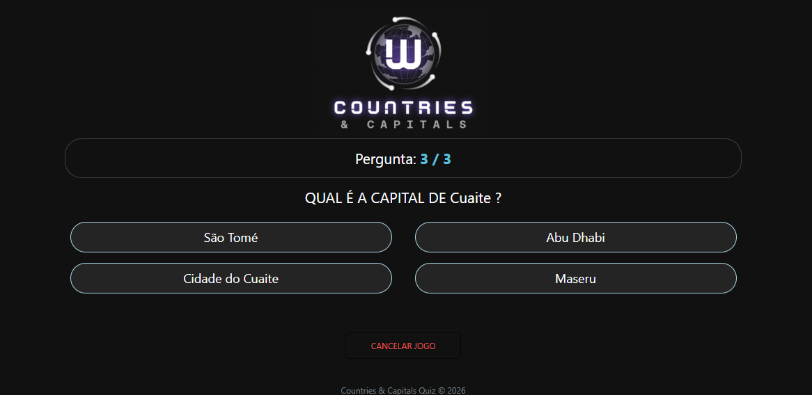
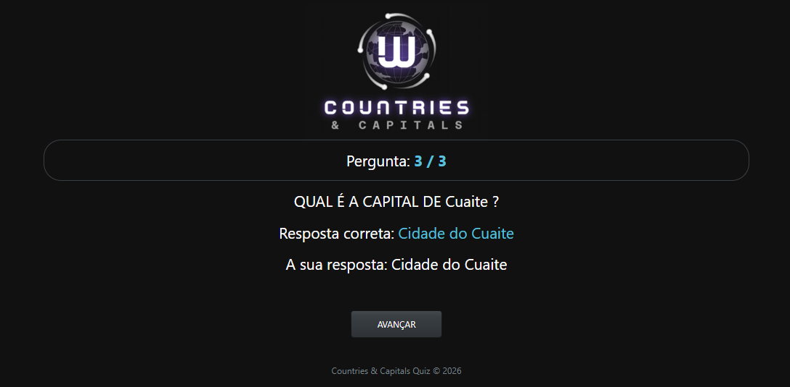
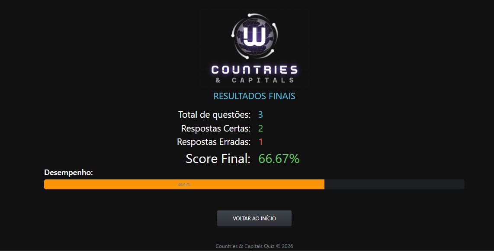

<p align="center">
  
</p>

# Quiz Game em Laravel


Um jogo de perguntas e respostas sobre capitais do mundo, desenvolvido como prática de boas práticas em Laravel.

## Tecnologias utilizadas
- Laravel 13 (framework PHP)
- PHP 8.4+
- Blade Components para views
- Bootstrap para estilização
- Docker com Laravel Sail para ambiente de desenvolvimento
- Git/GitHub para versionamento e publicação

## Objetivo
Este projeto foi criado para praticar lógica de programação, manipulação de sessões em Laravel e construção de um fluxo completo de jogo (início, perguntas, respostas e resultado final), sem uso de banco de dados, apenas com um array `app_data.php`.

## Processo de desenvolvimento
- Criei a lógica de preparação do quiz com perguntas aleatórias.  
- Desenvolvi a lógica de respostas, armazenando acertos e erros em sessão.  
- Implementei a tela de resultado final com cálculo de porcentagem.  
- Adicionei uma barra de progresso para mostrar o desempenho do jogador.  


## 📸 Capturas de tela

### Tela inicial


### Pergunta


### Resultado do quiz


### Resultado final



## Instalação e execução
1. Clone o repositório:
   ```bash
   git clone https://github.com/SOTILLOCRJ/quiz-game-laravel.git

## Próximos passos
- Adicionar ranking de jogadores  
- Implementar persistência em banco de dados  
- Criar versão com API REST  


- [x] Lógica de perguntas e respostas  
- [x] Sessões para armazenar acertos e erros  
- [x] Tela de resultado com porcentagem  
- [ ] Ranking de jogadores  
- [ ] Persistência em banco de dados  
- [ ] API REST 
---

## Portfólio
Este projeto foi desenvolvido como prática de boas práticas em Laravel, Docker e GitHub.  
Também compõe meu portfólio, permitindo que recrutadores avaliem tanto o código quanto a organização do desenvolvimento.